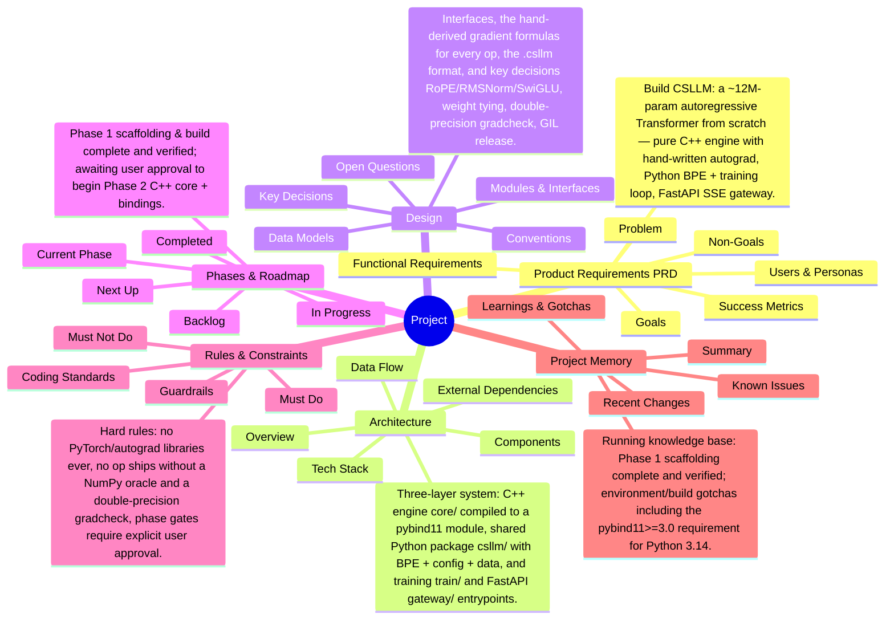

# Project Mind Map

<!-- Auto-generated by knbase. Do not edit by hand. -->

## Index

| File | State | Summary |
| --- | --- | --- |
| prd | ok | Build CSLLM: a ~12M-param autoregressive Transformer from scratch — pure C++ engine with hand-written autograd, Python BPE + training loop, FastAPI SSE gateway. |
| architecture | ok | Three-layer system: C++ engine (core/) compiled to a pybind11 module, shared Python package (csllm/) with BPE + config + data, and training (train/) and FastAPI (gateway/) entrypoints. |
| design | ok | Interfaces, the hand-derived gradient formulas for every op, the .csllm format, and key decisions (RoPE/RMSNorm/SwiGLU, weight tying, double-precision gradcheck, GIL release). |
| phase | ok | Phase 1 (scaffolding & build) complete and verified; awaiting user approval to begin Phase 2 (C++ core + bindings). |
| rules | ok | Hard rules: no PyTorch/autograd libraries ever, no op ships without a NumPy oracle and a double-precision gradcheck, phase gates require explicit user approval. |
| memory | ok | Running knowledge base: Phase 1 (scaffolding) complete and verified; environment/build gotchas including the pybind11>=3.0 requirement for Python 3.14. |

_Updated: 2026-07-21T09:58:31.943Z_
