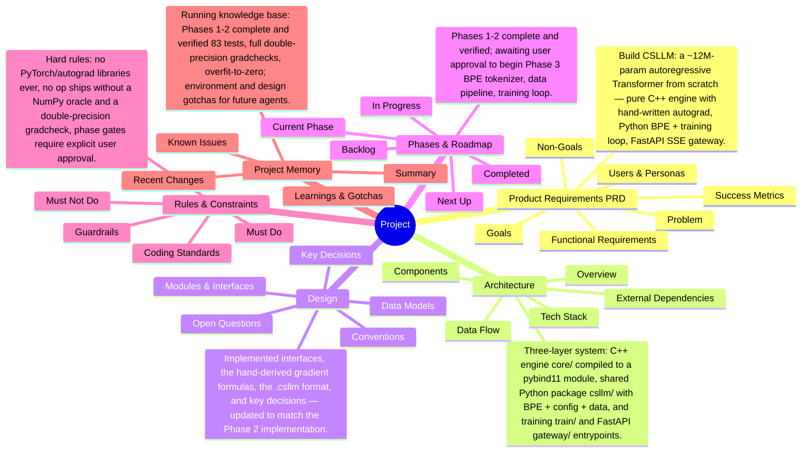

# Project Mind Map

<!-- Auto-generated by knbase. Do not edit by hand. -->

## Index

| File | State | Summary |
| --- | --- | --- |
| prd | ok | Build CSLLM: a ~12M-param autoregressive Transformer from scratch — pure C++ engine with hand-written autograd, Python BPE + training loop, FastAPI SSE gateway. |
| architecture | ok | Three-layer system: C++ engine (core/) compiled to a pybind11 module, shared Python package (csllm/) with BPE + config + data, and training (train/) and FastAPI (gateway/) entrypoints. |
| design | ok | Implemented interfaces, the hand-derived gradient formulas, the .csllm format, and key decisions — updated to match the Phase 2 implementation. |
| phase | ok | Phases 1-2 complete and verified; awaiting user approval to begin Phase 3 (BPE tokenizer, data pipeline, training loop). |
| rules | ok | Hard rules: no PyTorch/autograd libraries ever, no op ships without a NumPy oracle and a double-precision gradcheck, phase gates require explicit user approval. |
| memory | ok | Running knowledge base: Phases 1-2 complete and verified (83 tests, full double-precision gradchecks, overfit-to-zero); environment and design gotchas for future agents. |

_Updated: 2026-07-21T10:31:19.914Z_
