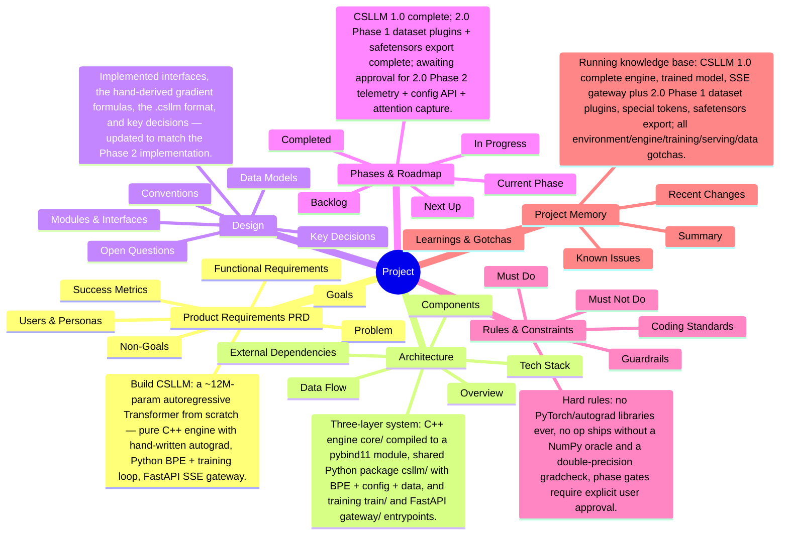

# Project Mind Map

<!-- Auto-generated by knbase. Do not edit by hand. -->

## Index

| File | State | Summary |
| --- | --- | --- |
| prd | ok | Build CSLLM: a ~12M-param autoregressive Transformer from scratch — pure C++ engine with hand-written autograd, Python BPE + training loop, FastAPI SSE gateway. |
| architecture | ok | Three-layer system: C++ engine (core/) compiled to a pybind11 module, shared Python package (csllm/) with BPE + config + data, and training (train/) and FastAPI (gateway/) entrypoints. |
| design | ok | Implemented interfaces, the hand-derived gradient formulas, the .csllm format, and key decisions — updated to match the Phase 2 implementation. |
| phase | ok | CSLLM 1.0 complete; 2.0 Phase 1 (dataset plugins + safetensors export) complete; awaiting approval for 2.0 Phase 2 (telemetry + config API + attention capture). |
| rules | ok | Hard rules: no PyTorch/autograd libraries ever, no op ships without a NumPy oracle and a double-precision gradcheck, phase gates require explicit user approval. |
| memory | ok | Running knowledge base: CSLLM 1.0 complete (engine, trained model, SSE gateway) plus 2.0 Phase 1 (dataset plugins, special tokens, safetensors export); all environment/engine/training/serving/data gotchas. |

_Updated: 2026-07-21T11:48:11.702Z_
